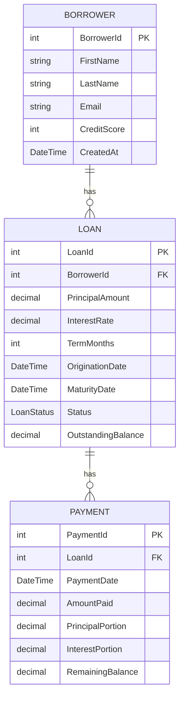

# LoanDash

Full stack loan portfolio dashboard using **Angular 21** (frontend) and **ASP.NET Core (.NET 10)** (backend), with a **SQL Server** database via Entity Framework Core. Utilizing clean architecture for the backend with Domain / Application / Infrastructure / Api layers.

Displays Loan portfolio information and individual account data including payment information.

---

## Stack

```
LoanDash/
├── loandash-client/                Angular 21 
│   └── src/app/
│       ├── pages/                  dashboard, loans, loan-detail
│       ├── services/               loan.service.ts
│       ├── models/                 typed DTOs
│       └── environments/           apiUrl config
│
└── loandash-api/                   .NET 10 Web API
    └── src/
        ├── LoanDash.Domain/        Entities, enums (Loan, Borrower, Payment)
        ├── LoanDash.Application/   Services, DTOs, interfaces
        ├── LoanDash.Infrastructure/EF Core DbContext, repositories, migrations, seeder
        └── LoanDash.Api/           Controllers, DI, middleware
```

---

## Architecture

The backend follows clean architecture with four distinct layers:
Dependency flow: `Api → Application → Domain`. Infrastructure implements interfaces defined in Application. Controllers are thin — they receive requests, call services, and return responses. No business logic lives in the API layer.

---

## Prerequisites

### Both platforms
| Tool | Version |
|------|---------|
| Node.js | 20+ |
| npm | 10.8+ |
| .NET SDK | 10.0+ |
| SQL Server | any recent edition (Express works); reachable on `localhost:1433` |

### macOS
- [Docker Desktop](https://www.docker.com/products/docker-desktop/) 


### Windows
- SQL Server LocalDB — included with Visual Studio, or download [SQL Server Express](https://www.microsoft.com/en-us/sql-server/sql-server-downloads)

---

## Database Setup

### macOS — SQL Server in Docker

Start the container:

```bash
docker run -e "ACCEPT_EULA=Y" -e 'SA_PASSWORD=LoanDash123!Strong' \
  -p 1433:1433 --name loandash-sql \
  --platform linux/amd64 \
  -d mcr.microsoft.com/mssql/server:2022-latest
```

After a reboot, restart the container:

```bash
docker start loandash-sql
```

Create the database — connect to `localhost` with SQL login `sa` / `LoanDash123!Strong` and run:

```sql
CREATE DATABASE LoanDash;
```

### Windows — SQL Server LocalDB

Start the LocalDB instance:

```bash
sqllocaldb start MSSQLLocalDB
```

Connect in SSMS or VS Code using `(localdb)\MSSQLLocalDB` with Windows Authentication, then run:

```sql
CREATE DATABASE LoanDash;
```

---

## Backend Setup

```bash
cd loandash-api
```

Install the EF Core CLI tool if not already installed:

```bash
dotnet tool install --global dotnet-ef
```

Restore packages:

```bash
dotnet restore
```

Update `src/LoanDash.Api/appsettings.Development.json` with your connection string.

**macOS:**
```json
{
  "ConnectionStrings": {
    "DefaultConnection": "Server=localhost,1433;Database=LoanDash;User Id=sa;Password=LoanDash123!Strong;TrustServerCertificate=True;"
  }
}
```

**Windows:**
```json
{
  "ConnectionStrings": {
    "DefaultConnection": "Server=(localdb)\\MSSQLLocalDB;Database=LoanDash;Trusted_Connection=True;TrustServerCertificate=True;"
  }
}
```

Run migrations. To create and run the migrations, run the commands below.

Ensure `dotnet ef` is installed on machine:

```bash
dotnet tool install --global dotnet-ef
```

1. Generate a migration file from the Infrastructure files (essentially a snapshot to generate db tables, look for initialCreate file):

```bash
dotnet ef migrations add InitialCreate \
  --project src/LoanDash.Infrastructure \
  --startup-project src/LoanDash.Api
```

2. Runs the generated InitialCreate file and creates the actual tables within the DB:

```bash
dotnet ef database update \
  --project src/LoanDash.Infrastructure \
  --startup-project src/LoanDash.Api
```

Run seed file, will generate 50 borrowers and Loans including a random number of payments.

Run `dotnet run`.

Validate:

```sql
SELECT COUNT(*) AS BorrowerCount FROM Borrowers;
SELECT COUNT(*) AS LoanCount FROM Loans;
SELECT COUNT(*) AS PaymentCount FROM Payments;
```

---

## Frontend Setup

```bash
cd loandash-client
npm install
ng serve
```

The app runs at `http://localhost:4200`.

The API base URL is configured in `src/environments/environment.ts`. Update the port if your API runs on a different port:

```typescript
export const environment = {
  production: false,
  apiUrl: 'http://localhost:5033/api'
};
```

---

## API Endpoints

| Method | Route | Description |
|---|---|---|
| GET | /api/loan | Paginated loan list with optional status filter |
| GET | /api/loan/{id} | Loan detail with borrower info and payment history |
| GET | /api/portfolio/summary | Portfolio KPIs for the dashboard |

### Query Parameters — GET /api/loan

| Parameter | Type | Default | Description |
|---|---|---|---|
| page | int | 1 | Page number (1-indexed) |
| pageSize | int | 10 | Results per page |
| status | string | null | Filter by: Active, Delinquent, PaidOff, Default |

---

## Features

- **Dashboard** — `/dashboard` — Displays overall loan data, including cards for 'Outstanding Balance', 'Active Loans', 'Delinquent', 'Paid off', 'Defaulted', 'Avg Interest Rate', 'Delinquency Rate'. Has two interactive charts 'Loans by Status' (Bar) and 'Monthly Payment Volume' (line).
- **Loan Portfolio** — `/loans` — Paginated and filterable table of all loans with status badges, pagination, and direct navigation to loan detail by view button.
- **Loan Detail** — `/loans/{:id}` — Full loan information dependant on the specific selected loan, displayed by loanID.

---

## Data Model



---

## Screenshots

- Dashboard
- Loans
- Loan-detail

---

## Notes

`appsettings.Development.json` is committed intentionally, for simplicity of use, due to being local only.
